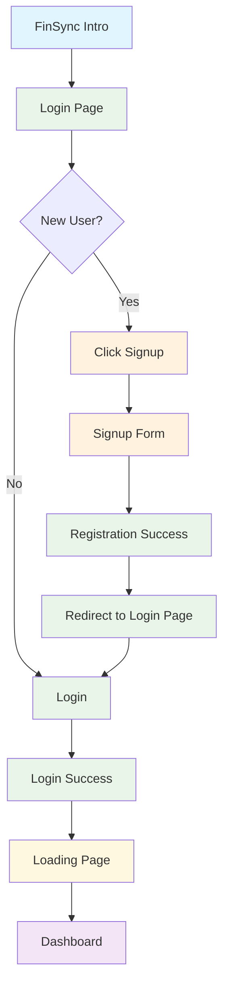

```mermaid
graph TD
    A[FinSync Intro] --> B[Login Page]
    B --> C{New User?}
    C -->|Yes| D[Click Signup]
    C -->|No| E[Login]
    D --> F[Signup Form]
    F --> G[Registration Success]
    G --> H[Redirect to Login Page]
    H --> E[Login]
    E --> I[Login Success]
    I --> J[Loading Page]
    J --> K[Dashboard]
    
    style A fill:#e1f5fe
    style B fill:#e8f5e8
    style D fill:#fff3e0
    style F fill:#fff3e0
    style G fill:#e8f5e8
    style H fill:#e8f5e8
    style E fill:#e8f5e8
    style I fill:#e8f5e8
    style J fill:#fff8e1
    style K fill:#f3e5f5
```